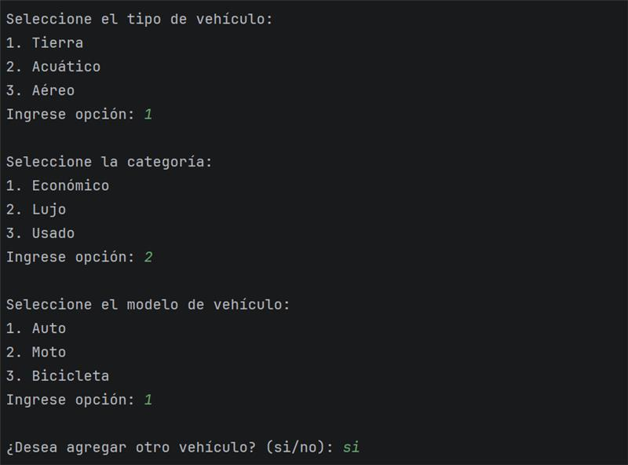
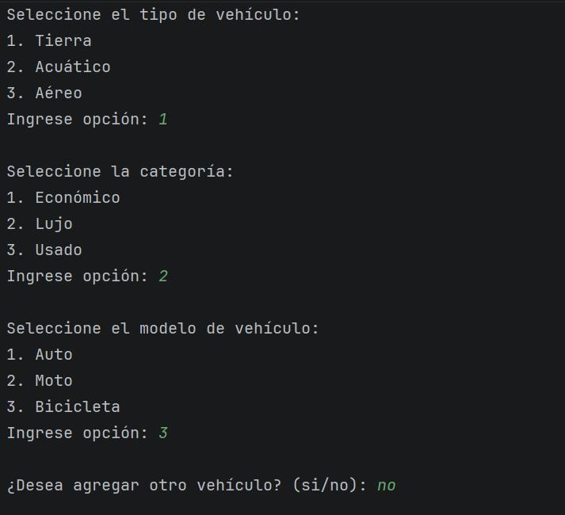
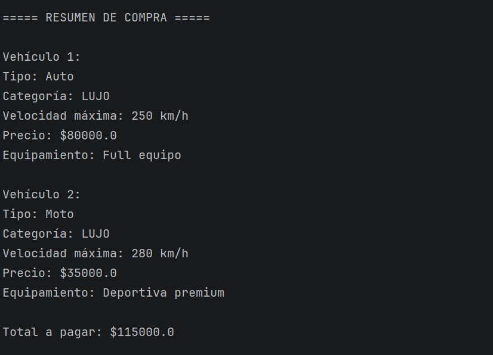

# DOSW_LAB2_ConcesionarioVehiculos_SeguraVelezBogota

In this project, Kevin Segura, Juan David Vélez and Juan Bogotá will solve the laboratory #2 of the DOSW class.

---

# Reto #3: Sistema de Concesionario de Vehículos

## 👥 Integrantes del grupo
- Kevin Segura
- Juan David Vélez
- Juan Bogotá

---

## Descripción del reto

En este reto se implementó un sistema de consola que simula el funcionamiento de un concesionario de vehículos.

El sistema permite al usuario:

- Seleccionar el tipo de vehículo (Tierra, Acuático o Aéreo).
- Seleccionar la categoría del vehículo (Económico, Lujo o Usado).
- Elegir el modelo específico según el tipo seleccionado.
- Agregar múltiples vehículos a un carrito de compra.
- Visualizar un resumen final con el detalle de cada vehículo y el total a pagar.

El sistema fue desarrollado aplicando principios de Programación Orientada a Objetos y el uso de un patrón creacional.

---

#  Patrón de Diseño

## Categoría del patrón
Patrones Creacionales

## Patrón utilizado
Factory Method

---

## Justificación

Se utilizó el patrón Factory Method debido a que el sistema requiere la creación de múltiples tipos de objetos (vehículos) dependiendo de las elecciones del usuario.

Este patrón permite:

- Encapsular la lógica de creación de objetos.
- Reducir el acoplamiento entre clases.
- Facilitar la escalabilidad del sistema.
- Mantener el código organizado y fácil de mantener.

La clase principal no crea directamente los vehículos, sino que delega la responsabilidad a las fábricas correspondientes.

---

#  Cómo se aplicó

Se implementó la siguiente estructura:

- Una interfaz `Vehiculo` que define el comportamiento general.
- Un `enum Categoria` para definir Económico, Lujo y Usado.
- Una clase abstracta `VehiculoFactory`.
- Tres fábricas concretas:
    - `TierraFactory`
    - `AcuaticoFactory`
    - `AereoFactory`
- Clases concretas de vehículos organizadas por tipo:
    - Tierra: Auto, Moto, Bicicleta
    - Acuático: Barco, Lancha, Yate
    - Aéreo: Avion, Avioneta, Helicoptero

La clase `Reto3`:

1. Solicita el tipo de vehículo.
2. Solicita la categoría.
3. Muestra los modelos disponibles según el tipo seleccionado.
4. Usa la factory correspondiente para crear el objeto.
5. Agrega el vehículo a un carrito (lista).
6. Calcula el total utilizando Streams.
7. Muestra el resumen final en consola.

---

#  Evidencias 

# Diagrama UML

